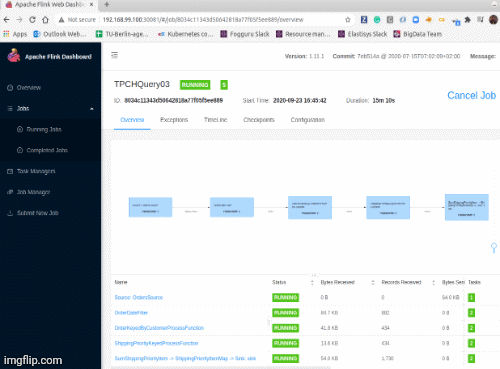

[](https://travis-ci.org/felipegutierrez/explore-flink)

This project is based on [Apache Flink 1.11.1](https://flink.apache.org/) with Docker 19.03.8, Kubernetes v1.19.0, minikube v1.13.1, Java 8, and Scala 2.12. The docker images can be found at [Docker Hub](https://hub.docker.com/repository/docker/felipeogutierrez/explore-flink). 

## Kubernetes + Docker + Kafka(1 ZooKeeper, 1 broker) + Flink(1 JobManager, 3 TaskManagers) + Prometheus + Grafana

This section aims to deploy the docker images above using minikube v1.13.1 Kubernetes v1.19.0 and Docker 19.03.8. It is based on the official tutorial [Flink with Kubernetes Setup](https://ci.apache.org/projects/flink/flink-docs-stable/ops/deployment/kubernetes.html).

Deploy the `Service` and `configmap` components of Flink cluster with Prometheus and Grafana into Kubernetes. Deploy 2 `PersistentVolumeClaim` to share a directory, a `Job` to create the TPC-H files, 1 `Job` with the Flink-JobManager, and 1 `Deployment` with 3 Flink-TaskManagers in Kubernetes.
```
minikube start --cpus 4 --memory 8192
minikube ssh 'sudo ip link set docker0 promisc on'
kubectl proxy

kubectl apply -f k8s/
```
List the objects, the resources:
```
kubectl get all
kubectl api-resources
```
Use the minikube IP address `minikube ip` to access the Flink UI-Web at [http://172.17.0.2:30081](http://172.17.0.2:30081), the Prometheus WebUI at [http://172.17.0.2:30091/targets](http://172.17.0.2:30091/targets) and [http://172.17.0.2:30091/graph](http://172.17.0.2:30091/graph), and the Grafana WebUI at [http://172.17.0.2:30011](http://172.17.0.2:30011).



### Troubleshooting:
Testing Kafka client:
```
$ kubectl exec -it kafka-client -- /bin/bash
root@kafka-client:/# cd /usr/bin/
root@kafka-client:/usr/bin# kafka-topics --list --zookeeper zookeeper:2181
__confluent.support.metrics
```
Logs:
```
kubectl describe pod <POD_ID>
kubectl logs <POD_ID>
kubectl exec -i -t <POD_ID> -- /bin/bash
kubectl -n kube-system top pods
kubectl get nodes
kubectl top nodes
kubectl get pods -A
kubectl top pods
```
Clean your Kubernetes cluster and delete everything when you finish to test.
```
kubectl delete statefulset flink-taskmanager kafka zookeeper
kubectl delete jobs flink-jobmanager tpch-dbgen-job
kubectl delete deployments kafka-broker grafana-deployment prometheus-deployment tpch-dbgen-deployment
kubectl delete services zookeeper kafka flink-jobmanager flink-jobmanager-rest flink-taskmanager prometheus-service-rest prometheus-service grafana-service-rest grafana-service
kubectl delete pvc tpch-dbgen-data-pvc tpch-dbgen-datarate-pvc
kubectl delete configmaps flink-config grafana-config prometheus-config
kubectl delete pods kafka-client

minikube stop
```

## Docker + Kafka(1 ZooKeeper, 1 broker) + Flink(1JobManager, 3TaskManagers) + Prometheus + Grafana
This section is here only to help if one would like to not use Kubernetes and deploy Flink only using Docker.
```
cd operations-playground
docker-compose build --no-cache
docker-compose up -d --remove-orphans
```
 - WebUI Flink: [http://127.0.0.1:8081/](http://127.0.0.1:8081/).
 - Prometheus console: [http://127.0.0.1:9090/](http://127.0.0.1:9090/).
 - Grafana dashboard: [http://127.0.0.1:3000/](http://127.0.0.1:3000/).
 - List the images running:
```
docker-compose ps -a
                    Name                                  Command               State                   Ports                
-----------------------------------------------------------------------------------------------------------------------------
operations-playground_clickevent-generator_1   /docker-entrypoint.sh java ...   Up       6123/tcp, 8081/tcp                  
operations-playground_client_1                 /docker-entrypoint.sh flin ...   Exit 0                                       
operations-playground_jobmanager_1             /docker-entrypoint.sh jobm ...   Up       6123/tcp, 0.0.0.0:8081->8081/tcp    
operations-playground_kafka_1                  start-kafka.sh                   Up       0.0.0.0:9094->9094/tcp              
operations-playground_taskmanager-01_1         /docker-entrypoint.sh task ...   Up       6123/tcp, 8081/tcp                  
operations-playground_taskmanager-02_1         /docker-entrypoint.sh task ...   Up       6123/tcp, 8081/tcp                  
operations-playground_taskmanager-03_1         /docker-entrypoint.sh task ...   Up       6123/tcp, 8081/tcp                  
operations-playground_zookeeper_1              /bin/sh -c /usr/sbin/sshd  ...   Up       2181/tcp, 22/tcp, 2888/tcp, 3888/tcp
```
Stop the images:
```
docker-compose down
```

### Troubleshooting:
```
docker-compose logs clickevent-generator|client|kafka|zookeeper|jobmanager|taskmanager-01|taskmanager-02|taskmanager-03
docker-compose images
docker container prune
docker system prune
docker image ls
docker image rm ID
docker run -i -t felipeogutierrez/tpch-dbgen /bin/bash
```

